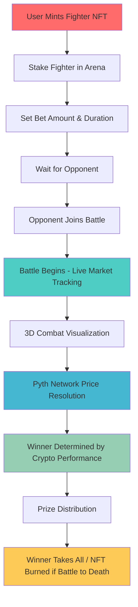

# 🥊 The Hash Pit

> **Where crypto meets combat, and volatility decides your fate.**

This isn't just another NFT game. This is a full-on gladiator arena, built on live crypto price movement, smart contracts, and some serious market drama.

## 🎯 What is The Hash Pit?

The Hash Pit is a revolutionary Web3 fighting game where your NFT fighters battle based on real cryptocurrency market performance. It's DeFi meets Tekken, where market sentiment becomes combat and crypto traders become strategists.

### 🏆 Core Concept

- **NFT Fighters**: Your on-chain champions, each bound to a specific cryptocurrency
- **Live Market Battles**: Fights unfold based on real-time crypto price movements
- **Smart Contract Arena**: Automated battles with on-chain resolution via Pyth Network
- **3D Visual Combat**: Watch your fighters battle in real-time 3D animations

## 🎮 How It Works

### 1. **Fighter Acquisition**

- Mint unique NFT fighters from the Armory
- Each fighter is bound to a specific cryptocurrency (Bitcoin, Ethereum, Solana)
- Fighters have different rarities and attributes

### 2. **Battle Creation**

- Stake your fighter NFT
- Set your bet amount (USDC or PIT tokens)
- Choose battle duration (6, 12, or 24 hours)
- Wait for an opponent to join

### 3. **Live Combat**

- No manual controls - battles are automated
- Fighters' performance mirrors their bound cryptocurrency's price movement
- Real-time 3D combat visualization
- Pyth Network provides on-chain price feeds

### 4. **Victory & Rewards**

- Winner determined by cryptocurrency performance
- Winner takes the entire prize pool
- "Battle to Death" mode burns the losing NFT

## 🔄 Battle Flow



## 🏗️ Smart Contract Architecture

### Core Contracts

| Contract                 | Address                                      | Purpose                              |
| ------------------------ | -------------------------------------------- | ------------------------------------ |
| **PIT Token (ERC20)**    | `0x18de406f1cda698b84d6305624ba67fef6a6a160` | Native token for betting and rewards |
| **Fighter NFT (ERC721)** | `0xea086600f1d3f609ee2647bee2b572231d5f771b` | Unique fighter characters            |
| **Fighter Sale**         | `0xdf065501f7830f39195b9c26a76b12fad2f9c543` | NFT minting and sales                |
| **Power-ups (ERC1155)**  | `0xaf589d9be1ed537f8e344b6bc8630e530ab678b9` | Battle enhancements                  |
| **Power-ups Sale**       | `0x27fe25898a8f9b7ffd4e174311127a0ff552e91e` | Power-up distribution                |
| **Arena Contract**       | `0xdf065501f7830f39195b9c26a76b12fad2f9c543` | Battle management and resolution     |

### Contract Features

- **ERC721**: Unique fighter NFTs with metadata
- **ERC1155**: Power-ups and battle enhancements
- **ERC20**: PIT tokens for betting and rewards
- **Automated Battles**: Smart contract-driven combat resolution
- **Pyth Integration**: Real-time price feeds for battle outcomes

## 📁 File Structure

```
app/
├── pages/
│   ├── _app.js                 # Global app configuration
│   ├── index.js               # Homepage with 3D background
│   ├── arena.js               # Battle arena management
│   └── basement-refactored.js # 3D fighting game interface
├── components/
│   ├── Navbar.jsx             # Global navigation
│   ├── GameUI.jsx             # 3D game interface
│   ├── EnhancedWalletConnect.jsx # Wallet connection
│   └── EnhancedWalletConnectInner.jsx
├── lib/
│   ├── gameEngine.js          # Three.js scene management
│   ├── characterManager.js    # 3D character handling
│   ├── combatSystem.js        # Battle logic and AI
│   ├── soundManager.js        # Audio effects
│   ├── combatLogger.js        # Battle event logging
│   ├── scoreCalculator.js     # Performance calculations
│   └── config.ts              # Configuration settings
├── hooks/
│   ├── useGameState.js        # React state management
│   ├── usePythPrices.js       # Pyth Network integration
│   └── useSantimentData.js    # Market sentiment data
├── abis/
│   ├── FighterNFT.json        # NFT contract ABI
│   └── SimpleCryptoClashArena.json # Arena contract ABI
└── styles/                    # CSS and styling
```

## 🛠️ Tech Stack

### Frontend

- **React.js** - User interface framework
- **Next.js** - Full-stack React framework
- **Three.js** - 3D graphics and animations
- **Web3.js/Ethers.js** - Blockchain interaction
- **Wagmi** - React hooks for Ethereum
- **Privy** - Authentication and wallet management

### Blockchain

- **Etherlink Testnet** - Primary blockchain network
- **Sequence Web SDK** - Wallet connection and management
- **Pyth Network** - Real-time price feeds
- **Solidity** - Smart contract development

### 3D & Graphics

- **Three.js** - 3D rendering engine
- **FBX Loader** - Character model loading
- **Animation Mixer** - Character animations
- **Sketchfab** - 3D environment backgrounds

### Development Tools

- **Node.js** - Runtime environment
- **pnpm** - Package manager
- **ESLint** - Code linting
- **Git** - Version control

## 🚀 Getting Started

### Prerequisites

- Node.js (v16 or higher)
- pnpm package manager
- MetaMask or compatible Web3 wallet
- Etherlink Testnet configured

### Installation

```bash
# Clone the repository
git clone <repository-url>
cd agent-arena

# Install dependencies
pnpm install

# Set up environment variables
cp .env.example .env
# Edit .env with your configuration

# Start development server
pnpm dev
```

### Environment Variables

```env
NEXT_PUBLIC_SEQUENCE_PROJECT_ACCESS_KEY=your_sequence_key
NEXT_PUBLIC_SEQUENCE_WAAS_CONFIG_KEY=your_waas_key
NEXT_PUBLIC_WALLET_CONNECT_PROJECT_ID=your_walletconnect_id
NEXT_PUBLIC_DEFAULT_CHAIN_ID=128123
NEXT_PUBLIC_APP_NAME="The Hash Pit"
```

## 🎮 Game Features

### Battle Types

- **Standard Battles**: Winner takes prize, loser keeps NFT
- **Battle to Death**: Losing NFT gets burned permanently

### Battle Duration

- **6 Hours**: Quick, high-volatility battles
- **12 Hours**: Medium-term strategic battles
- **24 Hours**: Long-term market analysis battles

### Visual Experience

- **Real-time 3D Combat**: Watch your fighters battle live
- **Health Bars**: Visual representation of crypto performance
- **Combat Logs**: Real-time battle events and market movements
- **Winner Announcements**: Clear victory/defeat indicators

## 🔗 Key Integrations

### Pyth Network

- Real-time cryptocurrency price feeds
- On-chain price resolution for battle outcomes
- Decentralized oracle network integration

### Sequence Web SDK

- Seamless wallet connection
- Multi-chain support
- User authentication and session management

### Etherlink Testnet

- Fast, scalable blockchain network
- Low transaction costs
- Developer-friendly environment

## 🎯 Roadmap

### Phase 1 ✅

- [x] Core smart contracts deployment
- [x] Basic 3D fighting interface
- [x] Wallet integration
- [x] Battle creation and joining

### Phase 2 🚧

- [ ] Pyth Network integration
- [ ] Live market data feeds
- [ ] Enhanced 3D animations
- [ ] Power-up system

### Phase 3 📋

- [ ] Tournament system
- [ ] Leaderboards
- [ ] Mobile optimization
- [ ] Cross-chain expansion

## 🤝 Contributing

We welcome contributions! Please see our [Contributing Guidelines](CONTRIBUTING.md) for details.

## 📄 License

This project is licensed under the MIT License - see the [LICENSE](LICENSE) file for details.

## 🆘 Support

- **Discord**: Join our community
- **Twitter**: Follow for updates
- **Documentation**: Check our docs
- **Issues**: Report bugs on GitHub

---

**Welcome to the future of fighting games. Welcome to The Hash Pit.** 🥊⚡
